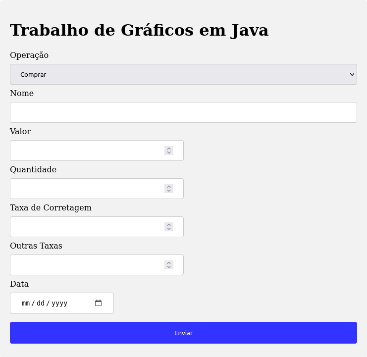
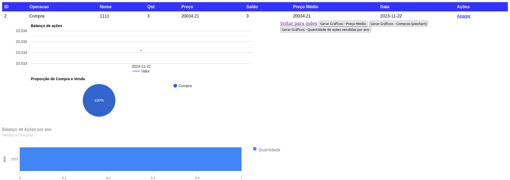

# Gráficos Java

Trabalho antigo de faculdade (2018). A ideia era criar um CRUD de Ações sendo possível visualizar em gráficos de linha e pizza a quantidade de ações vendidas por ano, preço médio e valor total.






## Configuração SQL

Para configurar o banco de dados, basta usar o dump localizado [aqui](dump.sql).

## Build

Esta verão utiliza maven. Vide [pom.xml](pom.xml).

Para fazer o build: 

```bash
mvn clean install
```